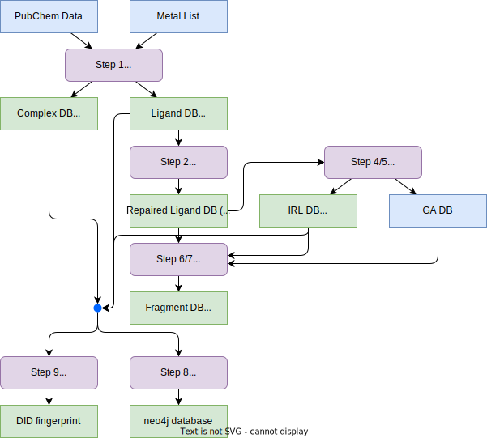

# ChemDB System Reengineering Report

**Author:** Shuang Liang  
**Date:** August 2025  

## System Design

### Processing Pipeline



### Layer Architecture

- M: Metal
- L1: Cordination Complex Space
- L2: Ligand Complexation Form
- L3: Ligand Standalone Form
- L4: Coordinative Fragment (Critical Subgraph)
- L5: Irreducible Ligand (Simplest Ligand-Metal Interaction)

## Validation Results

### Issues: Summary

| Layer | Total(L) | Total(R) | Missing(L) | Missing(R) | Mismatch | Note |
| --- | --- | --- | --- | --- | --- | --- |
| L1: complex | 1743822 | 1744387 | 315452 | 314887 | 2195 | 1. DID calculation mismatch<br>2. `As` as metal |
| L2: ligand | 1251031 | 1238339 | 1302 | 13994 | 7150 | 1. PubChem item does not exist in MySQL<br>2. Identical DID with different SMILES |
| L3: repaired_ligand | 1052314 | 1017513 | 834 | 35635 | 10217 | 1. L2 missing<br>2. source DID discrepancy | 
| L4: fragments | 2004704 | 1975913 | 1167941 | 1196732 | 807972 | 1. IRL ID(version) discrepancy<br>2. Different fragments |

- **L**: our latest generated database
- **R**: the reference database in MySQL
- **Missing(L)**: Present in our generated database but absent in the MySQL database
- **Missing(R)**: Present in the MySQL database but absent in our generated database


### Issue1: L1 Missing/mismatch

```
[complex] rows L=1743822 R=1744387 | missing(L)=315452 missing(R)=314887 mismatches=2195
  top mismatch columns:
    - metal_info: 2163
    - inactive: 202
    - complex_smiles: 32
```

#### Missing example: (DID calculation mismatch)

SMILES:
`COC(=O)CN1C(=C(N=N1)[Sn](CCC(C(C(C(C(C(F)(F)F)(F)F)(F)F)(F)F)(F)F)(F)F)(CCC(C(C(C(C(C(F)(F)F)(F)F)(F)F)(F)F)(F)F)(F)F)CCC(C(C(C(C(C(F)(F)F)(F)F)(F)F)(F)F)(F)F)(F)F)C2=CC=CC=C2`

```
=== mysql/ComplexRawData250704.tsv ===
D000757416355996
=== tmp/complex_data.csv ===
D000000372158678
```

#### Mismatch example: (most due to `As`)
```
D002441557414699,"[{'Zn': '0'}, {'As': '3.0'}]",[{'Zn': '0'}],,,,
D002484183517630,"[{'As': '5.0'}, {'Fe': '0'}]",[{'Fe': '0'}],,,,
D002486783685942,"[{'As': '3.0'}, {'Zr': '0'}, {'As': '2.0'}]",[{'Zr': '0'}],,,,
D002598147782074,"[{'As': '5.0'}, {'Na': '0'}]",[{'Na': '0'}],,,,
D002613597821703,"[{'As': '5.0'}, {'Ca': '0'}]",[{'Ca': '0'}],,,,
D002732482996693,"[{'Rh': '0'}, {'As': '3.0'}]",[{'Rh': '0'}],,,,
```

### Issue2: L2 Missing/Mismatch

```
[ligand] rows L=1251031 R=1238339 | missing(L)=1302 missing(R)=13994 mismatches=7150
  top mismatch columns:
    - ligand_smiles: 7150
```

#### Missing example

SMILES:
`C1[C@H]([C@@H](CN1[S+](N2C[C@H]([C@@H](C2)C3=CC=CC=C3)C4=CC=CC=C4)N5C[C@H]([C@@H](C5)C6=CC=CC=C6)C7=CC=CC=C7)C8=CC=CC=C8)C9=CC=CC=C9.C1=CC=C(C=C1)[Sn-](C2=CC=CC=C2)(C3=CC=CC=C3)(F)F`

exist in PubChem, but not in MySQL database.

#### Mismatch example

```
D000608138929636,COc1ccc2ccccc2c1
D000608138929636,COC1=CC2=CC=CC=C2C=C1
```


### Issue3: L3 Missing/Mismatch

```
[repaired_ligand] rows L=1052314 R=1017513 | missing(L)=834 missing(R)=35635 mismatches=10217
  top mismatch columns:
    - old_smiles: 10216
    - source_did: 6143
    - is_repaired: 3537
    - new_smiles: 15
```

#### Missing example

Possibly caused by missing entries in L2.
```
D008278824179575,D008278824179575,[N-]=[N+]=N[As](c1ccccc1)(c1ccccc1)(c1ccccc1)c1ccccc1,C1=CC=C(C=C1)[As](C2=CC=CC=C2)(C3=CC=CC=C3)(C4=CC=CC=C4)N=[N+]=[N-],1
```

#### Mismatch example

Discrepancy in source DID values.
```
D000616554126230,C[C@@H]1CCNC[C@H]1C(=O)OC,C[C@H]1CCNC[C@@H]1C(=O)OC
source: D105009215728943,D131161518289814
```

### Issue4: L4 Missing/Mismatch

```
[fragments] rows L=2004704 R=1975913 | missing(L)=1167941 missing(R)=1196732 mismatches=807972
  top mismatch columns:
    - fragment_irl_did: 807972
    - fragment_irl_smiles: 280928
    - fragment_smiles: 1
```

#### Mismatch example

key = (Fragment_DID, source_DID)
Mismatch due to differing IRL ID in the latest version.
```
__key__,fragment_irl_did__left,fragment_irl_did__right,fragment_irl_smiles__left,fragment_irl_smiles__right,fragment_smiles__left,fragment_smiles__right
"('D000002303737811', 'D000002303737811')",D6309404796,D014903684517508,C1=CC=NC(=C1)N,c1cc2ccncc2cn1,,
```

#### Missing example

```
=== data/mysql/FragmentFull0704.tsv ===
source_DID      fragment_smiles fragment_DID    fragment_IRL_did        fragment_IRL_smiles
171795:D024241878524814 Nc1nccc2ccncc12 D000002303737811        D6309404796     C1=CC=NC(=C1)N
171796:D024241878524814 N#Cc1ccccc1     D205359071246363        D9989783474     C#N

=== tmp/fragments.csv ===
source_did,fragment_smiles,fragment_DID,fragment_IRL_did,fragment_IRL_smiles
4473101:D024241878524814,Nc1cc2cc(-c3ccccc3)nc(N)c2cn1,D082913453320164,D014903684517508,c1cc2ccncc2cn1
4473102:D024241878524814,C#N,D036696664872168,D036696664872168,C#N
```


